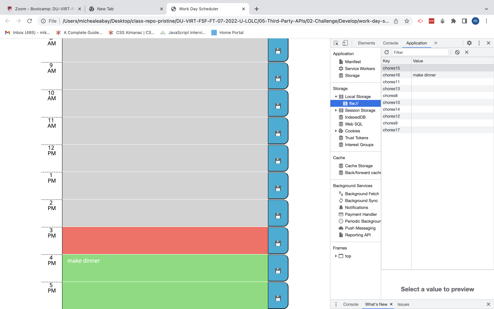

# 📅 work-day-scheduler

- As a busy student myself, I understand the struggle of scheduling your work-day schedule on a daily basis.

* I believe this simple but effectual schedular will help you hit your daily goals easily!

- All the chores you write will be stored in `local storage` so you won't have to worry about losing your data.

* Time blocks will be colored grey if they are in the past, red if it's present time, and green if it's in the future.

## Images

The following images demonstrate the web application's appearance and functionality:

## 🔗 [link to deployed application!](https://miketigray.github.io/work-day-scheduler/)
